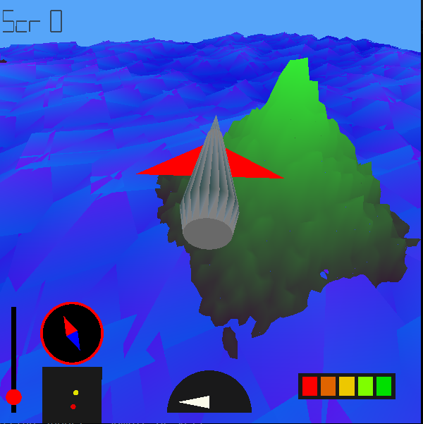
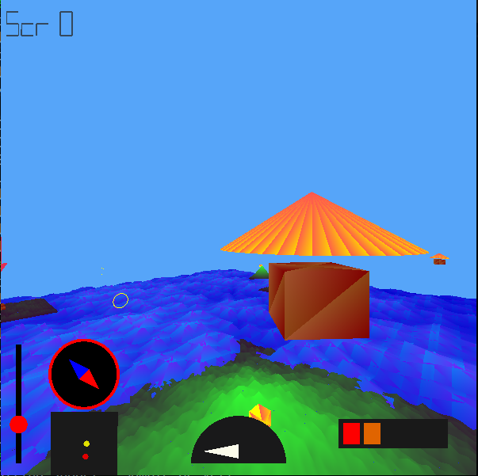

# Airplane-Simulation-Game
A 3D game made using OpenGL library in C++

Run the command `./airplane_simulator` inside the build folder to start the game

## Controls
- Up arrow -> move forward
- Down arrow -> move down
- Space -> move up
- Left arrow -> turn left
- Right arrow - >turn right
- A -> shoot Missile
- D -> drop Bomb
- Q -> Rotate anti clockwise
- E -> rotate clockwise
- 3 -> Plane view 
- 4 -> cockpit view
- 5 -> Top view
- 6 -> Helicopter view
- 7 -> Tower view
- B -> Barrel Roll
- L -> Looping the Loop

## Features

1. Movements - The airplane has been provided realistic movements in the 3D space
2. Terrain - Terrain has been generated using a height map. That is each point the terrain has been assigned individual heights so as to make    	 them look realistic.
3. Design of Mountains and Volcanos
4. A cut scene is played when doing a barrel roll or loop the loop.
5. Wave effect in water.
6. A mini map and compass in the dashboard.Shows the positions of next checkpoint and the plane.

## Some ScreenShots from the game

